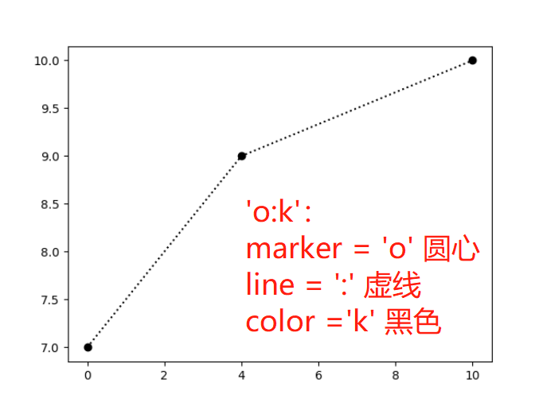
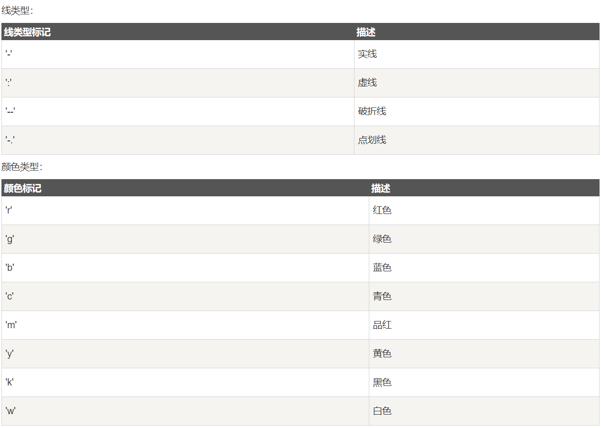

### 1. Pyplot

```python
import numpy as np
import matplotlib.pyplot as plt

# 绘制基本图形
x = np.array([0, 4, 10])
y = np.array([7, 9, 10])
plt.plot(x, y)
plt.show()
```


### 2. 绘图标记（marker)

> 设置marker，大小，里层颜色和外层颜色：  
> `marker`、`markersize(ms)`、`markerfacecolor(mfc)`、`markeredgecolor(mef)`

```python
import numpy as np
import matplotlib.pyplot as plt

x = np.array([0, 4, 10])
y = np.array([7, 9, 10])
# 设置maker
plt.plot(x, y, marker='o')
plt.show()
```


#### marker的参数：


#### 快捷设置

> 设置包括下面三种：`[marker][linestyle][color]`

```python
import numpy as np
import matplotlib.pyplot as plt

x = np.array([0, 4, 10])
y = np.array([7, 9, 10])
plt.plot(x, y, 'o:k')
# 也等同于以下设置
plt.plot(x, y, marker='o', linestyle=':', color='k')
plt.show()
```


> 线（linestype=ls）和颜色（color=c）的类型包括：
>


```python
import numpy as np
import matplotlib.pyplot as plt

x = np.array([0, 4, 10])
y = np.array([7, 9, 10])
# 设置marker的大小、内部颜色和外层边缘的颜色
plt.plot(x, y, 'o:k', ms=13, mfc='c', mec='k')
```


### 3. 绘制线

> 设置线段类型、颜色、线段粗细：  
> `linestyle(ls)`、`color(c)`、`linewidth(lw)`

