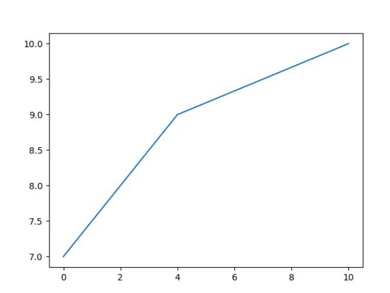
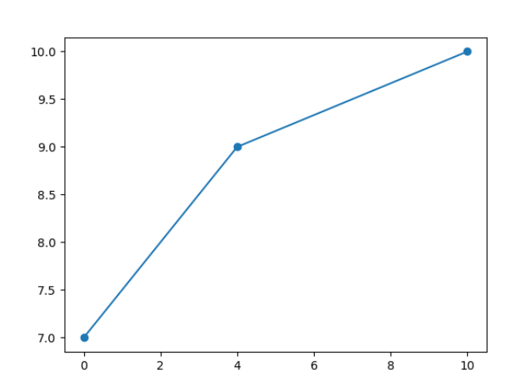
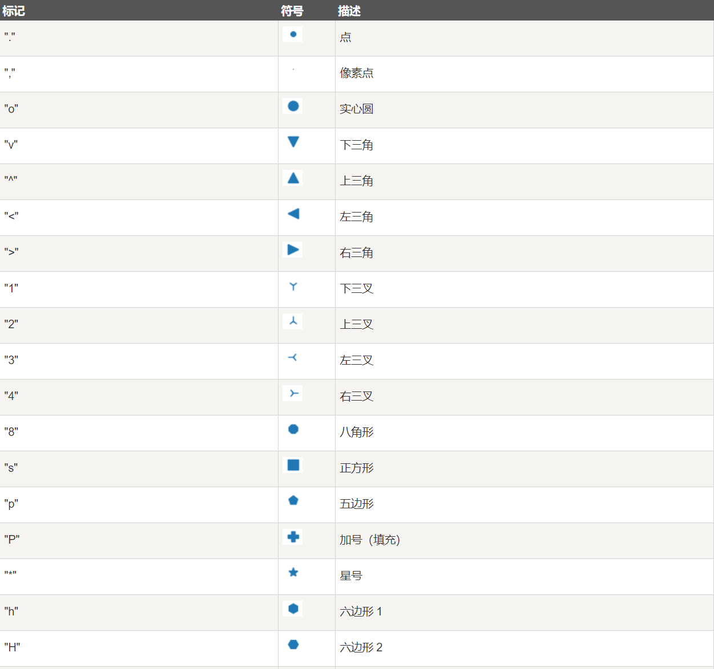
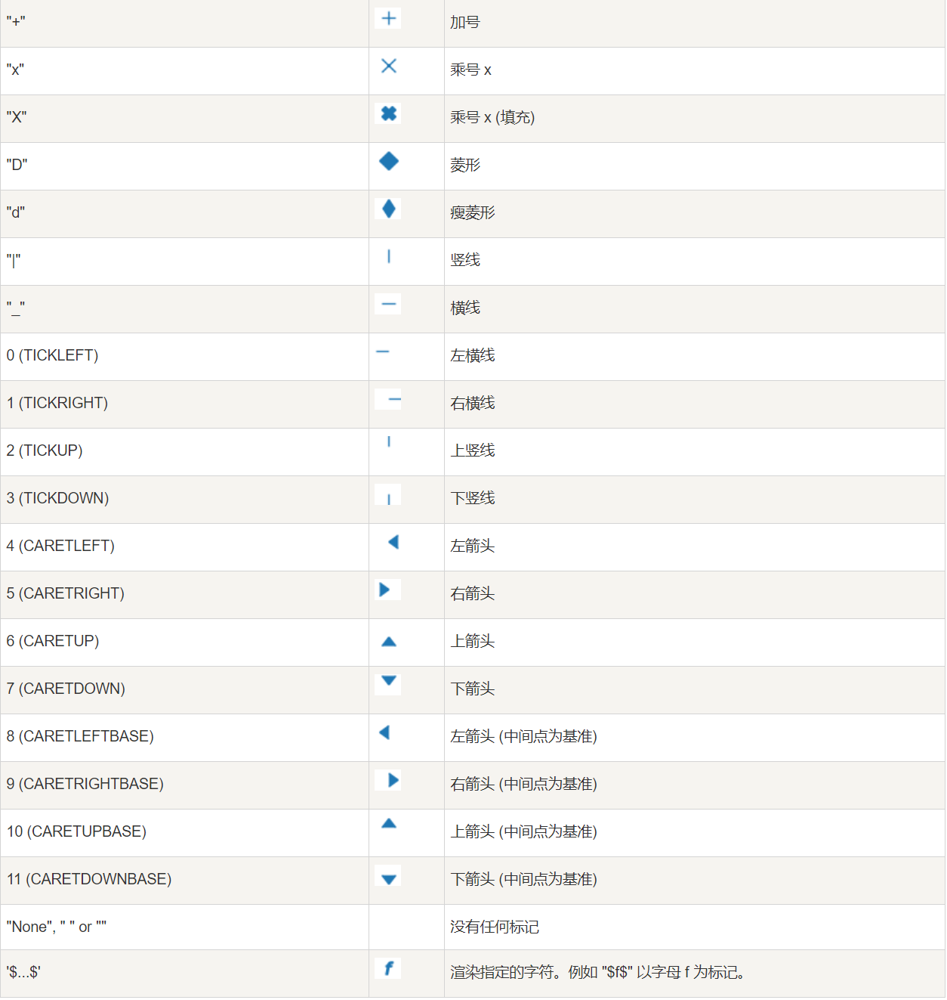
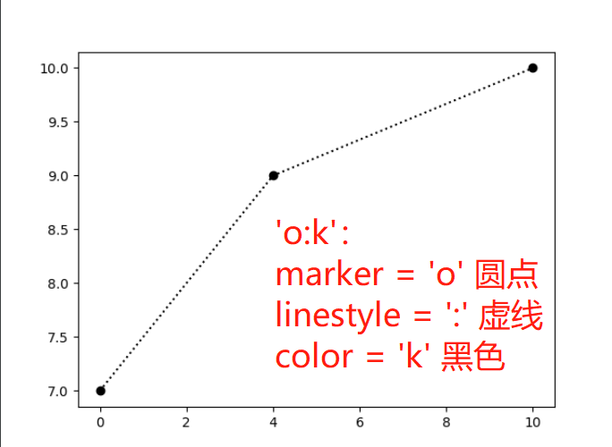
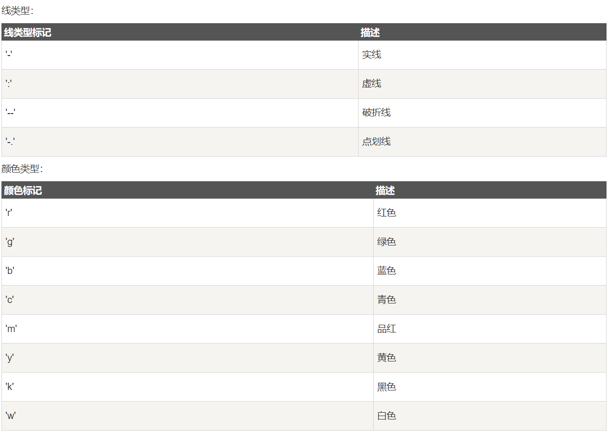
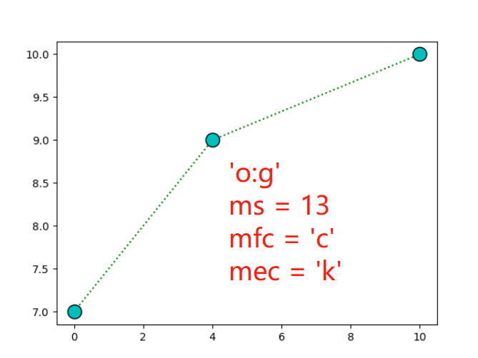
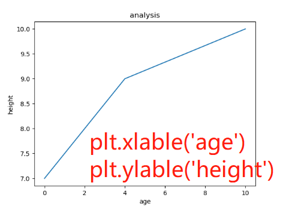
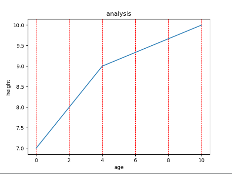
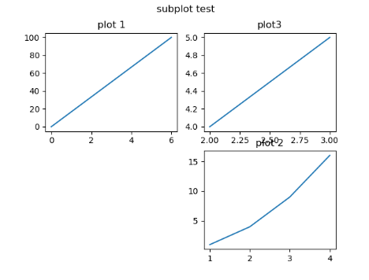

### 1. Pyplot

```python
import numpy as np
import matplotlib.pyplot as plt

# 绘制基本图形
x = np.array([0, 4, 10])
y = np.array([7, 9, 10])
plt.plot(x, y)
plt.show()
```



### 2. 绘图标记（marker)

> 设置marker，大小，里层颜色和外层颜色：  
> `marker`、`markersize(ms)`、`markerfacecolor(mfc)`、`markeredgecolor(mef)`

```python
import numpy as np
import matplotlib.pyplot as plt

x = np.array([0, 4, 10])
y = np.array([7, 9, 10])
# 设置maker
plt.plot(x, y, marker='o')
plt.show()
```



#### marker的参数：




#### 快捷设置

> 设置包括下面三种：`[marker][linestyle][color]`

```python
import numpy as np
import matplotlib.pyplot as plt

x = np.array([0, 4, 10])
y = np.array([7, 9, 10])
plt.plot(x, y, 'o:k')
# 也等同于以下设置
plt.plot(x, y, marker='o', linestyle=':', color='k')
plt.show()
```


> 线（linestype=ls）和颜色（color=c）的类型包括：
>


```python
import numpy as np
import matplotlib.pyplot as plt

x = np.array([0, 4, 10])
y = np.array([7, 9, 10])
# 设置marker的大小、内部颜色和外层边缘的颜色
plt.plot(x, y, 'o:k', ms=13, mfc='c', mec='k')
```



### 3. 绘制线

> 设置线段类型、颜色、线段粗细：  
> `linestyle(ls)`、`color(c)`、`linewidth(lw)`

### 4. 轴标签和标题

> `plt.xlabel()` 与`plt.ylabel()`设置两个标签  
> `plt.title()`设置标题  
> 通过`loc变量`设置label和title的位置

```python
import matplotlib.pyplot as plt
import numpy as np

x = np.array([0, 4, 10])
y = np.array([7, 9, 10])
plt.plot(x, y)
plt.title('analysis')
plt.xlabel('age')
plt.ylabel('height')
plt.show()
```



### 5. 网格线

> `plt.grid(b=None,which='major',axis='both',**kw=)`:  
> kw包括 `color`、`linestyle`、`linewidth`

```python
import matplotlib.pyplot as plt
import numpy as np

x = np.array([0, 4, 10])
y = np.array([7, 9, 10])
plt.plot(x, y)
plt.title('analysis')
plt.xlabel('age')
plt.ylabel('height')
plt.grid(b=True, axis='x', color='r', linestyle='--')
plt.show()
```



### 6. 绘制多图

> `subplot(nrows, ncols, index, **kwargs)`可以创建多图

```python
import matplotlib.pyplot as plt
import numpy as np

# plot 1
xpoints = np.array([0, 6])
ypoints = np.array([0, 100])
plt.subplot(2, 2, 1)  # 创建一个2*2大小的图，该图占据第一个格
plt.plot(xpoints, ypoints)
plt.title('plot 1')

# plot 3 
# ....

# plot 2
x1 = np.array([2, 3])
y1 = np.array([4, 5])
plt.subplot(2, 2, 2)
plt.plot(x1, y1)
plt.title('plot3')
plt.suptitle('subplot test')
plt.show()
```


> `subplots()`也可以创建多图

```python
import matplotlib.pyplot as plt
import numpy as np

x = np.random.randn(5)
y = np.random.randn(5)

# 创建两个及以上的图时，返回tuple
fig, (ax1, ax2) = plt.subplots(1, 2)
ax1.plot(x, y)
ax2.plot(x, y)

# 创建两个以上的图时，返回array  
fig, axs = plt.subplots(2, 2)
axs[0, 0].plot(x, y)
axs[1, 1].plot(x, y)

plt.show()

```
